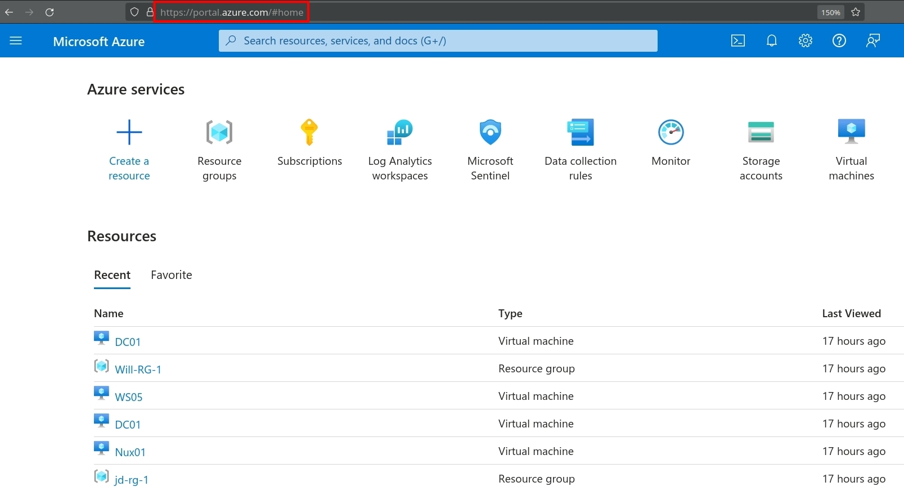
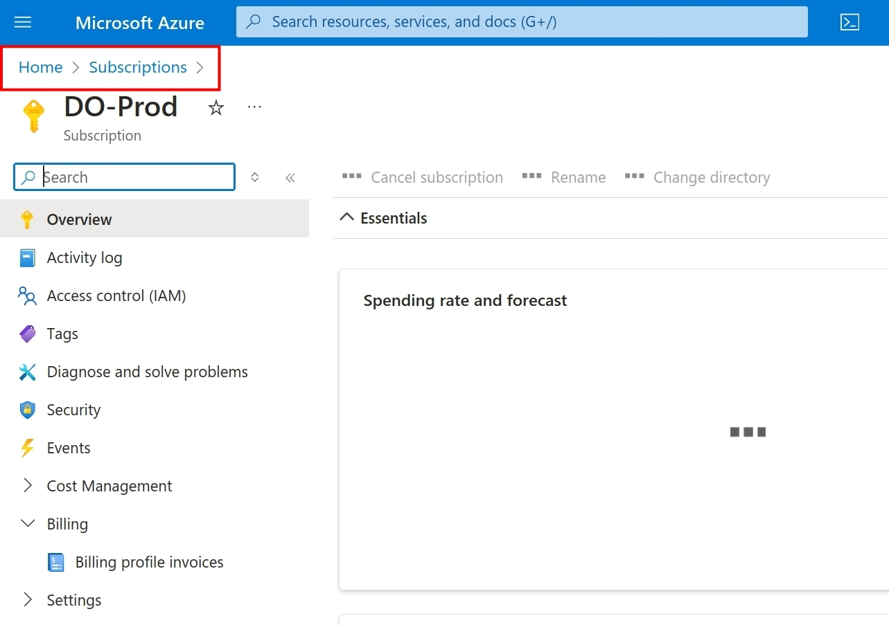
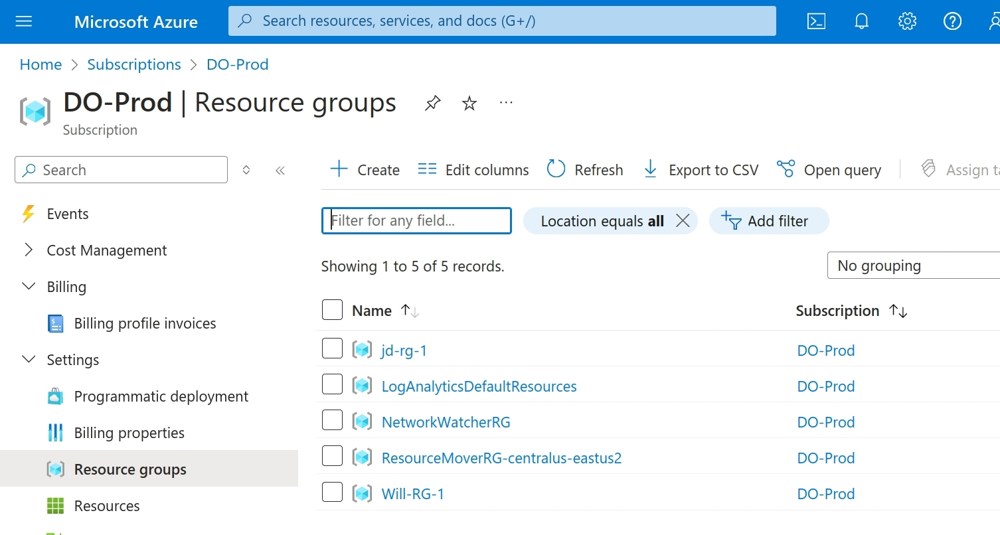
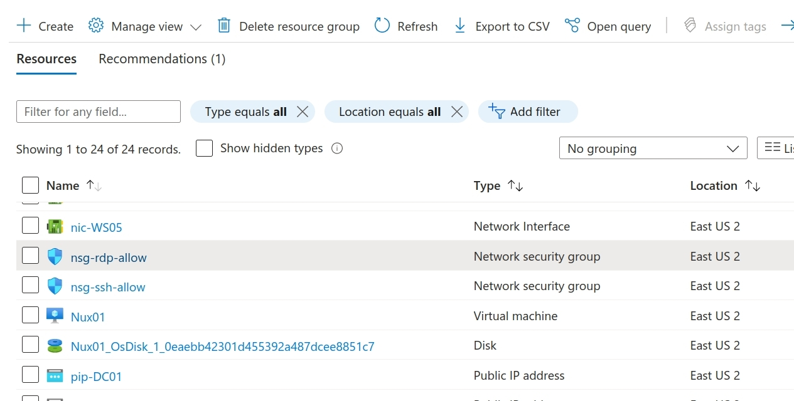
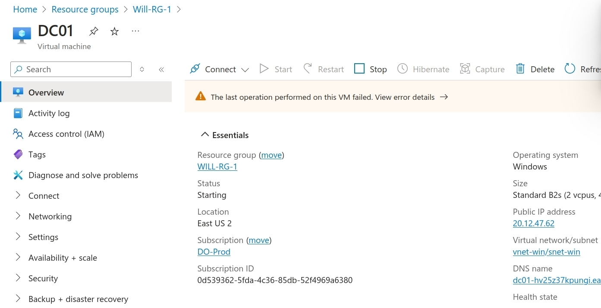
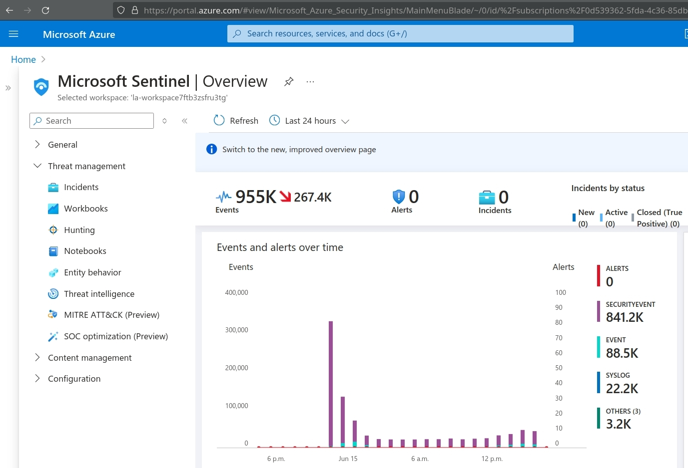
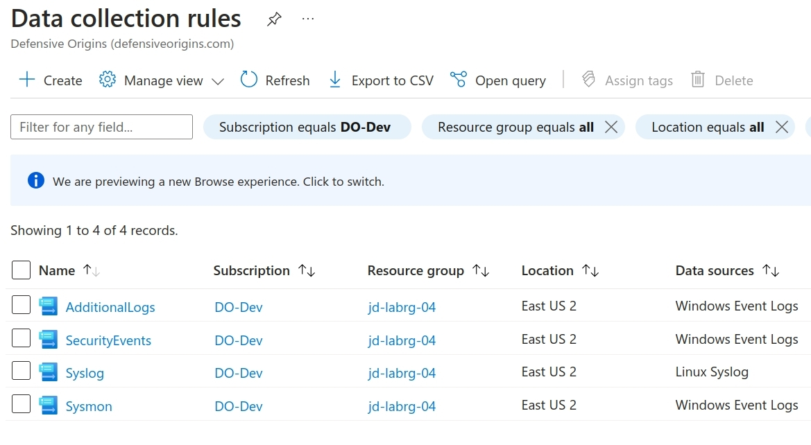

<!-- DO-MD-DEVNOTES-START -->
<!-- DO-MD-DEVNOTES-END -->
<!-- DO-MD-LABHEADER-START -->
<!-- DO-NAVTREE-TABLE-START -->
| ![][addlogosm]  [&#x1f3e0; Home][HOME] | Prerequisites: [[L0000]] - [YOU ARE HERE] -[[L0102]]   Labs: [[L0103]] - [[L0104]] - [[L0105]] - [[L2001]] - [[L2002]] - [[L2003]] - [[L2004]] - [[L2005]] - [[L2006a]] - [[L2006b]] -  [[L2007]] - [[L2008]] - [[L2009]] - [[L2010]] - [[L2011]] - [[L2012]] - [[L2013]] - [[L2014]] -  [[&#128210; EvID Ref][evidref]]| 
|--------|:--------|
<!-- DO-NAVTREE-TABLE-END -->

<!-- DO-LAB-TITLE START -->
# L0101 - Azure Components
Defensive Origins - Assumed Compromise Course Lab
<!-- DO-LAB-TITLE END-->

<table><tr><td width=50% valign=top>

## &#128210; Lab Overview

</td><td width=50% valign=top>

## &#x1f4cb; Lab Objectives

</td></tr><tr><td width=50% valign=top>

<!-- DO-LAB-OVERVIEW START -->
In this lab, participants will gain hands-on experience with essential Azure components, including the Azure Portal, subscriptions, resource groups, and Microsoft Sentinel. The lab is designed to provide an understanding of how to navigate and utilize Azure services to manage and secure cloud resources effectively for this course. By the end of the lab, participants will be able to navigate the 
Azure platform, manage the Azure resources used in class, and understand the hierarchical structure of the Azure platform..
<!-- DO-LAB-OVERVIEW END -->

</td><td width=50% valign=top>

<!-- DO-LAB-OBJECTIVES START -->
 &#x1F4AC;  What is Azure?  
 &#x1F4AC;  What is a subscription?  
 &#x1F4AC;  What are resource groups?   
 &#x1F4AC;  What is Microsoft Sentinel?  
 &#x1F4AC;  What is Kusto Query Language?  
 &#x2611; Access and Navigate Azure Resources  
 &#x2611; Access Subscription Information  
 &#x2611;  Access Resource Groups  
 &#x2611; Access Microsoft Azure Sentinel  

<!-- DO-LAB-OBJECTIVES END -->

</td></tr></table>

<!-- DO-MD-LABHEADER-END -->
<!-- DO-MD-LAB-START -->

## &#x2460; Azure: portal.azure.com

<blockquote>

What is the Azure Portal? https://learn.microsoft.com/en-us/azure/azure-portal/azure-portal-overview

The landing page for all things Azure is https://portal.azure.com. Once you deploy a lab environment, the subscription, resource groups, and underlying resources can be managed from here. 

|  | 
|------------------------------------------------|

Feel free to click through the various features, functionalities, and services. 

&#x21E8; *Step Complete, Go to the next step!*

</blockquote>

## &#x2461; Subscriptions

<blockquote>

On Azure, a subscription is a container with its own billing, infrastructure, IAM configurations, quotas, and resource groups. Tons more too. 

|  | 
|------------------------------------------------|

One of the more important items in a subscription is the resource quotas and their limits. As an example, you probably cannot deploy a second lab environment in your default subscription due to the limit on B class CPUs. Quota increase requests facilitate this. 

|  | 
|------------------------------------------------|

&#x21E8; *Step Complete, Go to the next step!*

</blockquote>

## &#x2462; Resource Groups

<blockquote>

Resource groups are accessible through the Azure UI in various ways, like the search function, from the portal.azure.com homepage, the navigation tree, etc. 

|  | 
|------------------------------------------------|

Each subscription has its own resource groups, which contain things like virtual machines, network configuration settings, storage accounts, and disks.

|  | 
|------------------------------------------------|

Resource groups contain Azure *resources*. As an example, clicking through to the virtual machine resource, you can see we various controls, like start, stop, and restart. We can see the resource's IP address and DNS names. 

|  | 
|------------------------------------------------|

&#x21E8; *Step Complete, Go to the next step!*

</blockquote>

## &#x2463; Microsoft Sentinel

<blockquote>

Sentinel will be used throughout the course as a log analytics tool. Sentinel uses kusto query language (KQL) as a front end language for performing searches and investigations against log data ingested through our data collection rules. 

The Sentinel application is located at https://portal.azure.com/#browse/microsoft.securityinsightsarg%2Fsentinel and, once your data collection rules are configured, will look something like the following screenshot.

|  | 
|------------------------------------------------|

&#x21E8; *Step Complete, Go to the next step!*

</blockquote>

## &#x2464; Kusto Query Language

<blockquote>

What is KQL? https://learn.microsoft.com/en-us/azure/data-explorer/kusto/query/

KQL quick reference: https://learn.microsoft.com/en-us/azure/data-explorer/kusto/query/kql-quick-reference

&#x21E8; *Lab Complete!*

</blockquote>

## &#x2465; Data Collection Rules

<blockquote>

What is a data collection rule (DCR)? 
- Configuration directive for your Azure Monitor Agent (Windows or Linux) to collect some data or logs.
- You can collect performance data on your web applications.
- Information about your containers or metrics for various things.
- For Windows, it's usually just an XPath query for Windows logs.
- For Linux, it's usually a specific request for system logs (like auth or authpriv).

|  | 
|------------------------------------------------|

Additional and detailed reference: https://learn.microsoft.com/en-us/azure/azure-monitor/essentials/data-collection-rule-overview

&#x21E8; *Lab Complete!*

</blockquote>

Copyright - All Rights Reserved, Defensive Origins LLC
<!-- DO-MD-FOOTER-END -->

<!-- DO-MD-SHORTCUTS-START -->
[1]: https://defensiveorigins.com/
[2]: https://wildwesthackinfest.com/training/
[APT]:https://github.com/DefensiveOrigins/AtomicPurpleTeam
[Cheat-Sheets]:9-Others/Cheatsheets/
[DefOrg]: https://defensiveorigins.com/
[Div1]: ../../Z-images/div/div1.png
[Div2]: ../../Z-images/div/div2.png
[DO]: https://www.defensiveorigins.com
[DO1]: ../../Z-images/logo/DO1.png
[DO1sm]: ../../Z-images/logo/DO1sm.png
[DOAboutUs]: https://defensiveorigins.com/about-us
[DOAZLab]: https://www.doazlab.com
[DOAZLab-Github]: https://github.com/DefensiveOrigins/DO-LAB
[DOImage]: ../../Z-images/do_darkbackground.jpg
[DOImage]:Z-images/do_darkbackground.jpg
[DORegister]: https://defensiveorigins.com/first-to-know/
[DOTraining]: https://training.defensiveorigins.com
[evid1]: https://github.com/DefensiveOrigins/SysmonCommunityGuide/blob/master/chapters/process-creation.md
[evid10]: https://github.com/DefensiveOrigins/SysmonCommunityGuide/blob/master/chapters/process-access.md
[evid11]: https://github.com/DefensiveOrigins/SysmonCommunityGuide/blob/master/chapters/file-create.md
[evid1100]: https://docs.microsoft.com/en-us/windows/security/threat-protection/auditing/event-1100
[evid1102]: https://docs.microsoft.com/en-us/windows/security/threat-protection/auditing/event-1102
[evid12]: https://github.com/DefensiveOrigins/SysmonCommunityGuide/blob/master/chapters/registry-actions.md
[evid13]: https://github.com/DefensiveOrigins/SysmonCommunityGuide/blob/master/chapters/registry-actions.md
[evid14]: https://github.com/DefensiveOrigins/SysmonCommunityGuide/blob/master/chapters/registry-actions.md
[evid15]: https://github.com/DefensiveOrigins/SysmonCommunityGuide/blob/master/chapters/file-stream-creation-hash.md
[evid16]: https://www.ultimatewindowssecurity.com/securitylog/encyclopedia/event.aspx?eventid=90016
[evid17]: https://github.com/DefensiveOrigins/SysmonCommunityGuide/blob/master/chapters/named-pipes.md
[evid18]: https://github.com/DefensiveOrigins/SysmonCommunityGuide/blob/master/chapters/named-pipes.md
[evid19]: https://www.ultimatewindowssecurity.com/securitylog/encyclopedia/event.aspx?eventid=90019
[evid2]: https://github.com/DefensiveOrigins/SysmonCommunityGuide/blob/master/chapters/file-create-time-change.md
[evid20]: https://www.ultimatewindowssecurity.com/securitylog/encyclopedia/event.aspx?eventid=90020
[evid21]: https://www.ultimatewindowssecurity.com/securitylog/encyclopedia/event.aspx?eventid=90021
[evid22]: https://github.com/DefensiveOrigins/SysmonCommunityGuide/blob/master/chapters/dns-query.md
[evid23]: https://github.com/DefensiveOrigins/SysmonCommunityGuide/blob/master/chapters/file_delete_detected.md
[evid24]: https://github.com/DefensiveOrigins/SysmonCommunityGuide/blob/master/chapters/clipboard-capture.md
[evid25]: https://github.com/DefensiveOrigins/SysmonCommunityGuide/blob/master/chapters/process-tampering.md
[evid255]: https://docs.microsoft.com/en-us/sysinternals/downloads/sysmon
[evid26]: https://github.com/DefensiveOrigins/SysmonCommunityGuide/blob/master/chapters/file_delete_detected.md
[evid28]: https://github.com/DefensiveOrigins/SysmonCommunityGuide/blob/master/chapters/file-delete.md
[evid3]: https://github.com/DefensiveOrigins/SysmonCommunityGuide/blob/master/chapters/network-connections.md
[evid4]: https://www.ultimatewindowssecurity.com/securitylog/encyclopedia/event.aspx?eventid=90004
[evid4610]: https://docs.microsoft.com/en-us/windows/security/threat-protection/auditing/event-4610
[evid4624]: https://docs.microsoft.com/en-us/windows/security/threat-protection/auditing/event-4624
[evid4625]: https://docs.microsoft.com/en-us/windows/security/threat-protection/auditing/event-4625
[evid4627]: https://docs.microsoft.com/en-us/windows/security/threat-protection/auditing/event-4627
[evid4634]: https://docs.microsoft.com/en-us/windows/security/threat-protection/auditing/event-4634
[evid4647]: https://docs.microsoft.com/en-us/windows/security/threat-protection/auditing/event-4647
[evid4648]: https://docs.microsoft.com/en-us/windows/security/threat-protection/auditing/event-4648
[evid4656]: https://docs.microsoft.com/en-us/windows/security/threat-protection/auditing/event-4656
[evid4657]: https://docs.microsoft.com/en-us/windows/security/threat-protection/auditing/event-4657
[evid4660]: https://docs.microsoft.com/en-us/windows/security/threat-protection/auditing/event-4660
[evid4661]: https://docs.microsoft.com/en-us/windows/security/threat-protection/auditing/event-4661
[evid4662]: https://docs.microsoft.com/en-us/windows/security/threat-protection/auditing/event-4662
[evid4663]: https://docs.microsoft.com/en-us/windows/security/threat-protection/auditing/event-4663
[evid4670]: https://docs.microsoft.com/en-us/windows/security/threat-protection/auditing/event-4670
[evid4672]: https://docs.microsoft.com/en-us/windows/security/threat-protection/auditing/event-4672
[evid4673]: https://docs.microsoft.com/en-us/windows/security/threat-protection/auditing/event-4673
[evid4688]: https://docs.microsoft.com/en-us/windows/security/threat-protection/auditing/event-4688
[evid4689]: https://docs.microsoft.com/en-us/windows/security/threat-protection/auditing/event-4689
[evid4690]: https://docs.microsoft.com/en-us/windows/security/threat-protection/auditing/event-4690
[evid4696]: https://docs.microsoft.com/en-us/windows/security/threat-protection/auditing/event-4696
[evid4697]: https://docs.microsoft.com/en-us/windows/security/threat-protection/auditing/event-4697
[evid4698]: https://docs.microsoft.com/en-us/windows/security/threat-protection/auditing/event-4698
[evid4699]: https://docs.microsoft.com/en-us/windows/security/threat-protection/auditing/event-4699
[evid4700]: https://docs.microsoft.com/en-us/windows/security/threat-protection/auditing/event-4700
[evid4701]: https://docs.microsoft.com/en-us/windows/security/threat-protection/auditing/event-4701
[evid4702]: https://docs.microsoft.com/en-us/windows/security/threat-protection/auditing/event-4702
[evid4703]: https://docs.microsoft.com/en-us/windows/security/threat-protection/auditing/event-4703
[evid4704]: https://docs.microsoft.com/en-us/windows/security/threat-protection/auditing/event-4704
[evid4705]: https://docs.microsoft.com/en-us/windows/security/threat-protection/auditing/event-4705
[evid4706]: https://docs.microsoft.com/en-us/windows/security/threat-protection/auditing/event-4706
[evid4707]: https://docs.microsoft.com/en-us/windows/security/threat-protection/auditing/event-4707
[evid4715]: https://docs.microsoft.com/en-us/windows/security/threat-protection/auditing/event-4715
[evid4716]: https://docs.microsoft.com/en-us/windows/security/threat-protection/auditing/event-4716
[evid4717]: https://docs.microsoft.com/en-us/windows/security/threat-protection/auditing/event-4717
[evid4719]: https://docs.microsoft.com/en-us/windows/security/threat-protection/auditing/event-4719
[evid4720]: https://docs.microsoft.com/en-us/windows/security/threat-protection/auditing/event-4720
[evid4722]: https://docs.microsoft.com/en-us/windows/security/threat-protection/auditing/event-4722
[evid4723]: https://docs.microsoft.com/en-us/windows/security/threat-protection/auditing/event-4723
[evid4724]: https://docs.microsoft.com/en-us/windows/security/threat-protection/auditing/event-4724
[evid4725]: https://docs.microsoft.com/en-us/windows/security/threat-protection/auditing/event-4725
[evid4726]: https://docs.microsoft.com/en-us/windows/security/threat-protection/auditing/event-4726
[evid4731]: https://docs.microsoft.com/en-us/windows/security/threat-protection/auditing/event-4731
[evid4732]: https://docs.microsoft.com/en-us/windows/security/threat-protection/auditing/event-4732
[evid4733]: https://docs.microsoft.com/en-us/windows/security/threat-protection/auditing/event-4733
[evid4735]: https://docs.microsoft.com/en-us/windows/security/threat-protection/auditing/event-4735
[evid4736]: https://docs.microsoft.com/en-us/windows/security/threat-protection/auditing/event-4736
[evid4738]: https://docs.microsoft.com/en-us/windows/security/threat-protection/auditing/event-4738
[evid4739]: https://docs.microsoft.com/en-us/windows/security/threat-protection/auditing/event-4739
[evid4740]: https://docs.microsoft.com/en-us/windows/security/threat-protection/auditing/event-4740
[evid4741]: https://docs.microsoft.com/en-us/windows/security/threat-protection/auditing/event-4741
[evid4742]: https://docs.microsoft.com/en-us/windows/security/threat-protection/auditing/event-4742
[evid4743]: https://docs.microsoft.com/en-us/windows/security/threat-protection/auditing/event-4743
[evid4764]: https://docs.microsoft.com/en-us/windows/security/threat-protection/auditing/event-4764
[evid4765]: https://docs.microsoft.com/en-us/windows/security/threat-protection/auditing/event-4765
[evid4767]: https://docs.microsoft.com/en-us/windows/security/threat-protection/auditing/event-4767
[evid4768]: https://docs.microsoft.com/en-us/windows/security/threat-protection/auditing/event-4768
[evid4769]: https://docs.microsoft.com/en-us/windows/security/threat-protection/auditing/event-4769
[evid4770]: https://docs.microsoft.com/en-us/windows/security/threat-protection/auditing/event-4770
[evid4773]: https://docs.microsoft.com/en-us/windows/security/threat-protection/auditing/event-4773
[evid4776]: https://docs.microsoft.com/en-us/windows/security/threat-protection/auditing/event-4776
[evid4780]: https://docs.microsoft.com/en-us/windows/security/threat-protection/auditing/event-4780
[evid4781]: https://docs.microsoft.com/en-us/windows/security/threat-protection/auditing/event-4781
[evid4782]: https://docs.microsoft.com/en-us/windows/security/threat-protection/auditing/event-4782
[evid4798]: https://docs.microsoft.com/en-us/windows/security/threat-protection/auditing/event-4798
[evid4799]: https://docs.microsoft.com/en-us/windows/security/threat-protection/auditing/event-4799
[evid4817]: https://docs.microsoft.com/en-us/windows/security/threat-protection/auditing/event-4817
[evid4907]: https://docs.microsoft.com/en-us/windows/security/threat-protection/auditing/event-4907
[evid4908]: https://docs.microsoft.com/en-us/windows/security/threat-protection/auditing/event-4908
[evid4964]: https://docs.microsoft.com/en-us/windows/security/threat-protection/auditing/event-4964
[evid5]: https://github.com/DefensiveOrigins/SysmonCommunityGuide/blob/master/chapters/process-termination.md
[evid5025]: https://docs.microsoft.com/en-us/windows/security/threat-protection/auditing/event-5025
[evid5136]: https://docs.microsoft.com/en-us/windows/security/threat-protection/auditing/event-5136
[evid5137]: https://docs.microsoft.com/en-us/windows/security/threat-protection/auditing/event-5137
[evid5138]: https://docs.microsoft.com/en-us/windows/security/threat-protection/auditing/event-5138
[evid5139]: https://docs.microsoft.com/en-us/windows/security/threat-protection/auditing/event-5139
[evid5140]: https://docs.microsoft.com/en-us/windows/security/threat-protection/auditing/event-5140
[evid5141]: https://docs.microsoft.com/en-us/windows/security/threat-protection/auditing/event-5141
[evid5142]: https://docs.microsoft.com/en-us/windows/security/threat-protection/auditing/event-5142
[evid5143]: https://docs.microsoft.com/en-us/windows/security/threat-protection/auditing/event-5143
[evid5144]: https://docs.microsoft.com/en-us/windows/security/threat-protection/auditing/event-5144
[evid5145]: https://docs.microsoft.com/en-us/windows/security/threat-protection/auditing/event-5145
[evid5152]: https://docs.microsoft.com/en-us/windows/security/threat-protection/auditing/event-5152
[evid5157]: https://docs.microsoft.com/en-us/windows/security/threat-protection/auditing/event-5157
[evid5158]: https://docs.microsoft.com/en-us/windows/security/threat-protection/auditing/event-5158
[evid5159]: https://docs.microsoft.com/en-us/windows/security/threat-protection/auditing/event-5159
[evid5168]: https://docs.microsoft.com/en-us/windows/security/threat-protection/auditing/event-5168
[evid5447]: https://docs.microsoft.com/en-us/windows/security/threat-protection/auditing/event-5447
[evid6]: https://github.com/DefensiveOrigins/SysmonCommunityGuide/blob/master/chapters/driver-loading.md
[evid6145]: https://docs.microsoft.com/en-us/windows/security/threat-protection/auditing/event-6145
[evid7]: https://github.com/DefensiveOrigins/SysmonCommunityGuide/blob/master/chapters/image-loading.md
[evid8]: https://github.com/DefensiveOrigins/SysmonCommunityGuide/blob/master/chapters/create-remote-thread.md
[evid9]: https://github.com/DefensiveOrigins/SysmonCommunityGuide/blob/master/chapters/raw-access-read.md
[evidsysmon]: https://docs.microsoft.com/en-us/sysinternals/downloads/sysmon
[H0004]: ../../../APT/9-Others/H0040-Instructors/README.md
[H0010]: ../../../APT/9-Others/H0010-PreReq/README.md
[ph_jd]: ../../Z-images/photo/jd1.png
[ph_ki]: ../../Z-images/photo/ki1.png
[refmstp-pdf]: https://docs.microsoft.com/en-us/windows/security/opbuildpdf/threat-protection/auditing/toc.pdf?branch=live
[refmstp-web]: https://docs.microsoft.com/en-us/windows/security/threat-protection/
[Survey]:https://forms.office.com/Pages/ResponsePage.aspx?id=ezi0P6h7Wky98F15YOOzAxFXFOo3MeNFpviudN0SuLhUMDNCT1NYWk5QWjlHUkMyMVhJVjFJTjhQMy4u
[WWHF]: https://wildwesthackinfest.com/
[addlogo]:../../Z-images/logo/add.png
[addlogosm]:../../Z-images/logo/addsm.png
<!-- DO-MD-SHORTCUTS-END -->

<!-- DO-MD-NAVTREE-SHORTCUTS-START -->
[Home]: ../../README.md
[evidref]: ../../9-Others/Cheatsheets/EventIDs.md
[L0000]: /1-Labs/0000-Course-Architecture/README.md
[L0101]: /1-Labs/0101-Azure-Components/README.md
[L0102]: /1-Labs/0102-Lab-Deploy/README.md
[L0103]: /1-Labs/0103-Initial-Access/README.md
[L0104]: /1-Labs/0104-Terminals/README.md
[L0105]: /1-Labs/0105-Azure-DCRs-Sentinel/README.md
[L0106]: /1-Labs/0101-Azure-Components/README.md
[L2001]: /1-Labs/2001-BadBlood/README.md
[L2002]: /1-Labs/2002-Deception/README.md
[L2003]: /1-Labs/2003-Initial-Checks/README.md
[L2004]: /1-Labs/2004-PowerShell-CMD/README.md
[L2006]: /1-Labs/2006-ADCS/README.md
[L2005]: /1-Labs/2005-Tooling/README.md
[L2006a]: /1-Labs/2006a-BloodHound/README.md
[L2006b]: /1-Labs/2006b-PlumHound/README.md
[L2007]: /1-Labs/2007-ADCS/README.md
[L2008]: /1-Labs/2008-Impacket/README.md
[L2009]: /1-Labs/2009-Password-Spray/README.md
[L2010]: /1-Labs/2010-C2-SSH/README.md
[L2011]: /1-Labs/2011-Coercion-Relay/README.md
[L2012]: /1-Labs/2012-LNK-Droppers/README.md
[L2013]: /1-Labs/2013-Attacker-Attribution/README.md
[L2014]: /1-Labs/2014-Atomic-Red-Team/README.md
<!-- DO-MD-NAVTREE-SHORTCUTS-END -->