<!-- DO-MD-DEVNOTES-START -->
<!-- DO-MD-DEVNOTES-END -->
<!-- DO-MD-LABHEADER-START -->
<!-- DO-NAVTREE-TABLE-START -->
| ![][addlogosm] <br>[&#x1f3e0; Home][HOME] | Prerequisites: [[L0000]] - [[L0101]] -[[L0102]] <br> Labs: [YOU ARE HERE] - [[L0104]] - [[L0105]] - [[L2001]] - [[L2002]] - [[L2003]] - [[L2004]] - [[L2005]] - [[L2006a]] - [[L2006b]] -  [[L2007]] - [[L2008]] - [[L2009]] - [[L2010]] - [[L2011]] - [[L2012]] - [[L2013]] - [[L2014]] - <br>[[&#128210; EvID Ref][evidref]]| 
|--------|:--------|
<!-- DO-NAVTREE-TABLE-END -->

<!-- DO-LAB-TITLE START -->
# L0103 Verify Lab Access
Defensive Origins - Assumed Compromise Course Lab
<!-- DO-LAB-TITLE END-->

<table><tr><td width=50% valign=top>

## &#128210; Lab Overview

</td><td width=50% valign=top>

## &#x1f4cb; Lab Objectives

</td></tr><tr><td width=50% valign=top>

<!-- DO-LAB-OVERVIEW START -->
This lab aims to ensure that participants can successfully access and log into a lab environment consisting of a Domain Controller (DC), a Windows workstation, and a Linux system. This verification is crucial for subsequent labs focusing on network and security tasks.
<!-- DO-LAB-OVERVIEW END -->

</td><td width=50% valign=top>

<!-- DO-LAB-OBJECTIVES START -->
&#x1F4AC;Discussion: Remote Desktop Access to DC01  
&#x1F4AC; Discussion: Remote Desktop Access to WS05  
&#x1F4AC; Discussion: SSH Access to Ubuntu Server (22.04)  
&#x2611; Accessing  Deployed Azure Resources  
&#x2611; Certificate Warnings and Signatures  
&#x2611; Initial Access  
&#x1F4AC; Defensive Considerations  
<!-- DO-LAB-OBJECTIVES END -->

</td></tr></table>


<!-- DO-MD-LABHEADER-END -->
<!-- DO-MD-LAB-START -->

<!-- DO-CREDENTIAL-REMINDER-START -->
<Details><summary>

## &#x1F512; Lab Credentials

</summary><blockquote>

### &#x1FA9F; Windows credentials

When logging into the Windows system, use the following credentials.

```Win-creds
doazlab\doadmin
DOLabAdmin1!
```

### &#x1F427; Linux credentials

When logging into the Linux system, use the following credentials.

```Linux-creds
doadmin
DOLabAdmin1!
```

</blockquote></details>

<!-- DO-CREDENTIAL-REMINDER-END -->
<Details><summary>

## &#x2460; Lab Deployment Network Connectivity 

</summary><blockquote>

The screenshot in this section demonstrates the output values from the course ARM template deployemnt. 

You will need all of these at various points throughout the course material. You should keep them handy in a notes document or similar quick-reference.

| 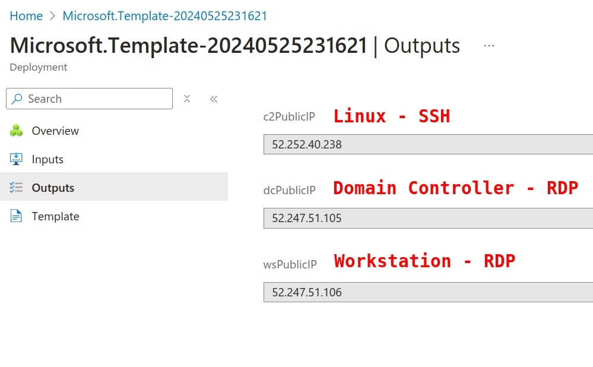 | 
|------------------------------------------------|


&#x21E8; *Step Complete, Go to the next step!*

</blockquote></details>


<Details><summary>

## &#x2461; Establish RDP Connections (from Linux) 

</summary><blockquote>

Establish RDP to the workstation and domain controller (Linux with Remmina)

From Linux, you can use the Remmina remote desktop (RDP) client software.

| 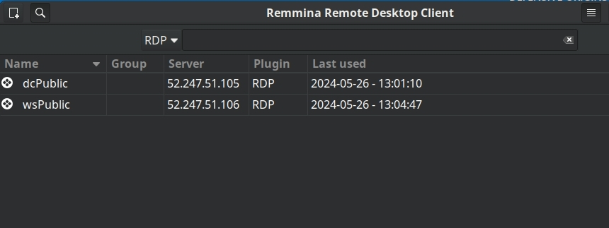 | 
|------------------------------------------------|

| &#x26a0; Note | Be sure to include the domain on the initial RDP connections.|
|---------------|--------------------------------------------------------------|

```Win-creds
doazlab\doadmin
DOLabAdmin1!
```

Establish an RDP connection to the IP address of your lab's domain controller. You will be prompted to accept a certificate that should match **DC01.doazlab.com**.

| 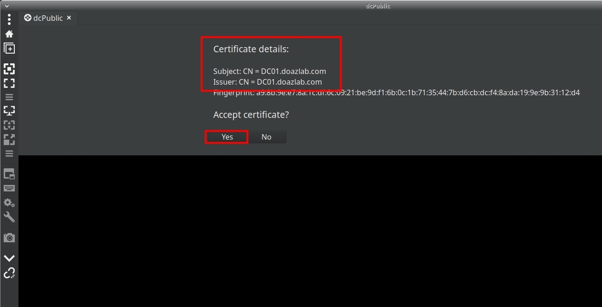 | 
|------------------------------------------------|

Establish an RDP connection to the IP address of your lab's workstation. You will be prompted to accept a certificate that should match **WS05.doazlab.com**.

| 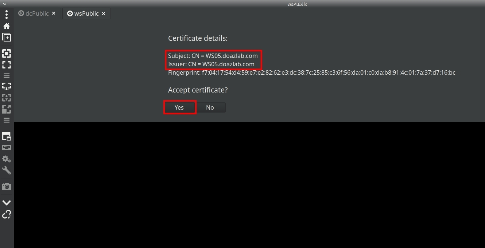 | 
|------------------------------------------------|

The domain controller will prompt you to accept the discovery settings. Your lab is isolated and our guidance is to click **Yes**. The course authors do not believe choosing **No** will affect any of the course content.

| 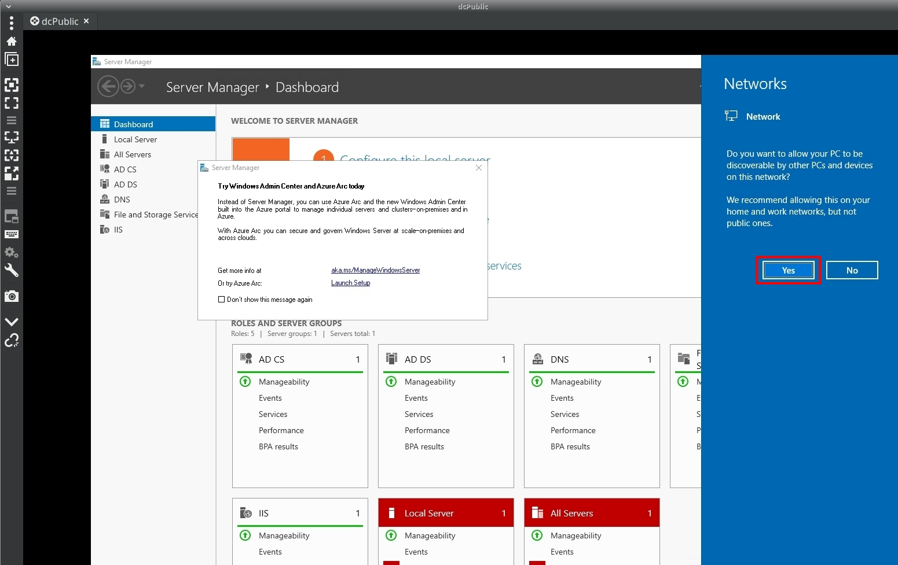 | 
|------------------------------------------------|

The first login to the workstation will require approximately ten minutes to fully build the user profile and desktop environment. 

| 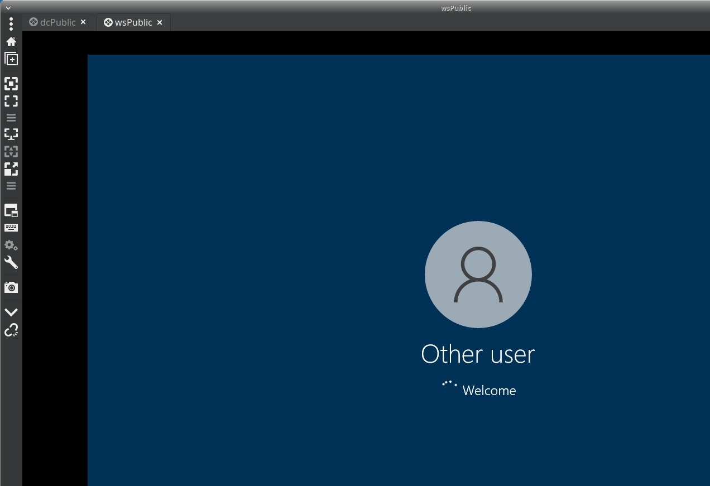 | 
|------------------------------------------------|

&#x21E8; *Step Complete, Go to the next step!*

</blockquote></details>


<Details><summary>

## &#x2462; Establish Remote Desktop Connections (from Windows) 

</summary><blockquote>

Establish RDP connections to the workstation and domain controller (Windows terminal services client)

The following screenshot includes an **example** mstsc connection string. *Your IP address will differ.*

| 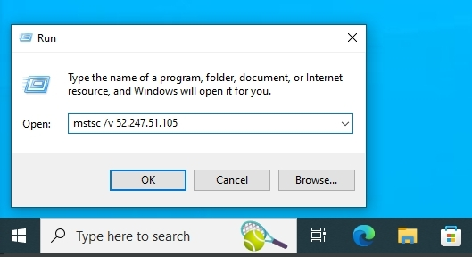 | 
|------------------------------------------------|

Be sure to include the domain on the initial RDP connections.

```Win-creds
doazlab\doadmin
DOLabAdmin1!
```

| 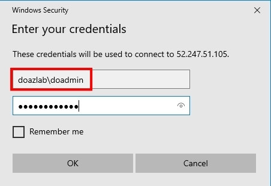 | 
|------------------------------------------------|

Establish an RDP connection to the IP address of your lab's domain controller. You will be prompted to accept a certificate that should match **DC01.doazlab.com**.

| 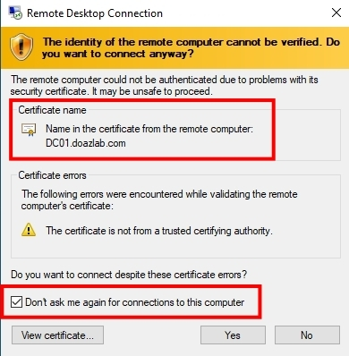 | 
|------------------------------------------------|

Establish an RDP connection to the IP address of your lab's workstation. You will be prompted to accept a certificate that should match **WS05.doazlab.com**.

| 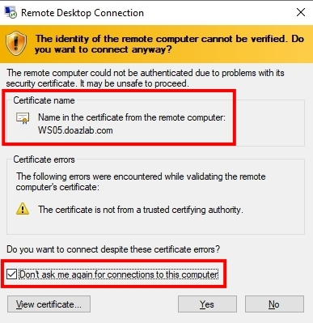 | 
|------------------------------------------------|

The domain controller will prompt you to accept the discovery settings. Your lab is isolated and our guidance is to click **Yes**. The course authors do not believe choosing **No** will affect any of the course content.

| 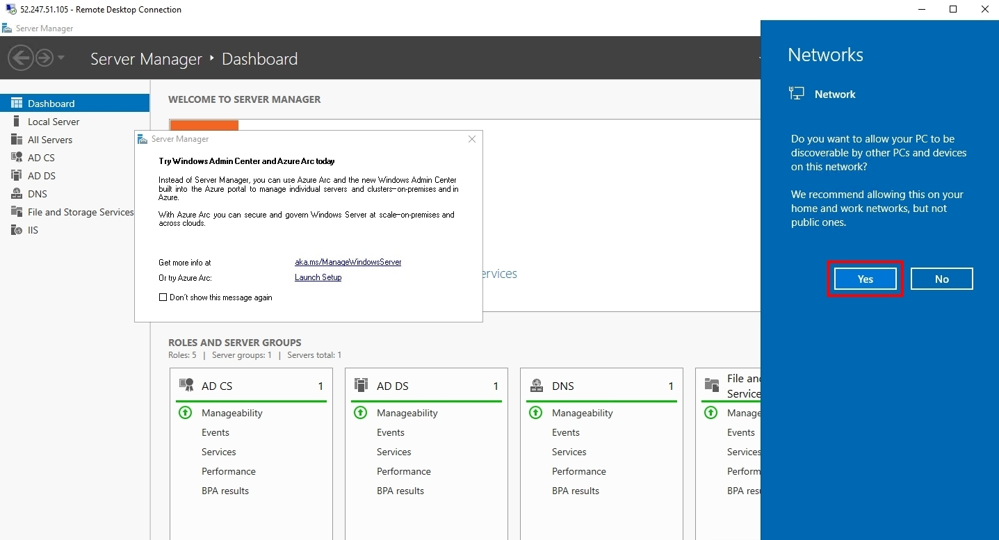 | 
|------------------------------------------------|

The first login to the workstation will require approximately ten minutes to fully build the user profile and desktop environment. The desktop background includes bginfo.exe as a desktop background for quick reference as to which system you have accessed. 

| 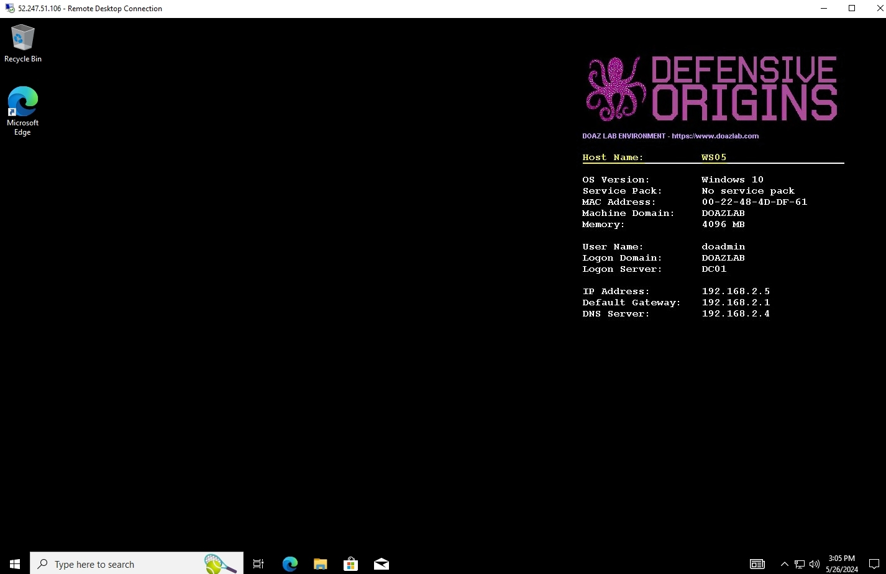 | 
|------------------------------------------------|

&#x21E8; *Step Complete, Go to the next step!*

</blockquote></details>


<Details><summary>

## &#x2463; Establish SSH Connection 

</summary><blockquote>

Assumed Compromise Lab

| &#x1F427; Bash Input | Linux Host: Nux01 |
|----------------------|-------------------|
```bash
ssh doadmin@'YOUR-PUB-C2-IP'
```

```Linux-creds
doadmin
DOLabAdmin1!
```

| 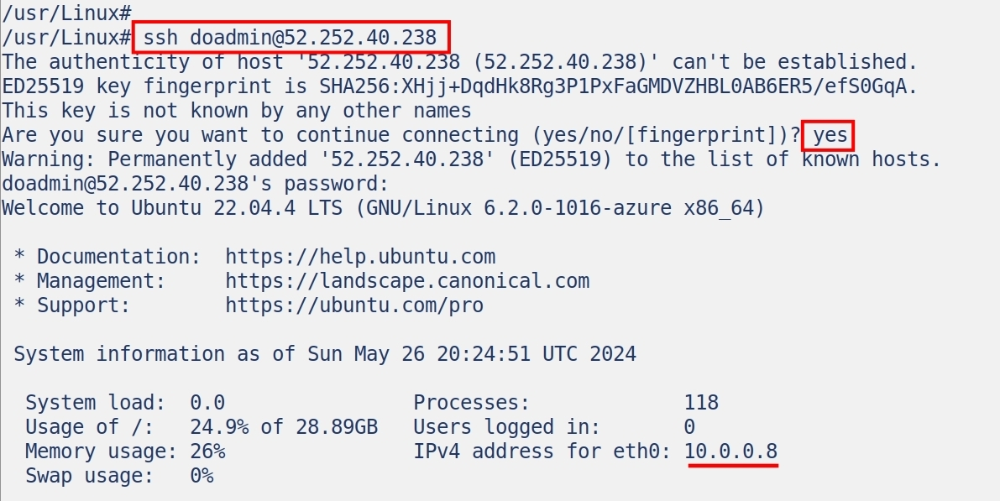 | 
|------------------------------------------------|

Did you know you can SSH directly from Windows 10 without additional installation, packages, or software? You can, straight from PowerShell.

| &#x1FA9F; PowerShell Input |
|-----------------------|
```PowerShell
ssh doadmin@'YOUR-PUB-C2-IP'
```

| 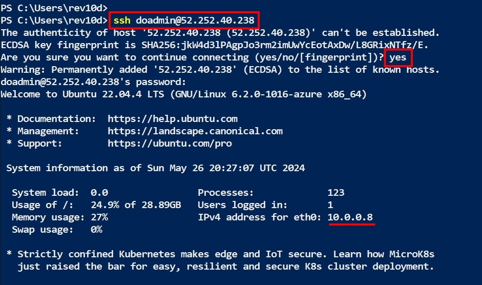 | 
|------------------------------------------------|

&#x21E8; *Step Complete, Go to the next step!*

</blockquote></details>

<Details><summary>

## &#x1f6e1; Defensive Considerations

</summary><blockquote>

Exposing services such as Remote Desktop Protocol (RDP) to the public internet without source filtering poses significant security risks. This practice can lead to various types of cyber threats and vulnerabilities, making systems susceptible to attacks. Services accessible to the internet exposes them to credetnial attacks, exploitation of vulnerabilities, network reconnaissance, denial of service attacks, and generally increases potential attack surface.

Mitigation strategies include creating specific access conditions such as limited to trusted source networks, use of VPN access, requiring Multi-Factor Authentication, and ensuring systems are fully patched.  Emerging technologies such as Zero-Trust remove the concept of "trusted networks" in leiu of stringent device inspection and control.

&#x21E8; *Lab Complete!*

</blockquote></details>


Copyright - All Rights Reserved, Defensive Origins LLC
<!-- DO-MD-FOOTER-END -->


<!-- DO-MD-SHORTCUTS-START -->
[1]: https://defensiveorigins.com/
[2]: https://wildwesthackinfest.com/training/
[APT]:https://github.com/DefensiveOrigins/AtomicPurpleTeam
[Cheat-Sheets]:9-Others/Cheatsheets/
[DefOrg]: https://defensiveorigins.com/
[Div1]: ../../Z-images/div/div1.png
[Div2]: ../../Z-images/div/div2.png
[DO]: https://www.defensiveorigins.com
[DO1]: ../../Z-images/logo/DO1.png
[DO1sm]: ../../Z-images/logo/DO1sm.png
[DOAboutUs]: https://defensiveorigins.com/about-us
[DOAZLab]: https://www.doazlab.com
[DOAZLab-Github]: https://github.com/DefensiveOrigins/DO-LAB
[DOImage]: ../../Z-images/do_darkbackground.jpg
[DOImage]:Z-images/do_darkbackground.jpg
[DORegister]: https://defensiveorigins.com/first-to-know/
[DOTraining]: https://training.defensiveorigins.com
[evid1]: https://github.com/DefensiveOrigins/SysmonCommunityGuide/blob/master/chapters/process-creation.md
[evid10]: https://github.com/DefensiveOrigins/SysmonCommunityGuide/blob/master/chapters/process-access.md
[evid11]: https://github.com/DefensiveOrigins/SysmonCommunityGuide/blob/master/chapters/file-create.md
[evid1100]: https://docs.microsoft.com/en-us/windows/security/threat-protection/auditing/event-1100
[evid1102]: https://docs.microsoft.com/en-us/windows/security/threat-protection/auditing/event-1102
[evid12]: https://github.com/DefensiveOrigins/SysmonCommunityGuide/blob/master/chapters/registry-actions.md
[evid13]: https://github.com/DefensiveOrigins/SysmonCommunityGuide/blob/master/chapters/registry-actions.md
[evid14]: https://github.com/DefensiveOrigins/SysmonCommunityGuide/blob/master/chapters/registry-actions.md
[evid15]: https://github.com/DefensiveOrigins/SysmonCommunityGuide/blob/master/chapters/file-stream-creation-hash.md
[evid16]: https://www.ultimatewindowssecurity.com/securitylog/encyclopedia/event.aspx?eventid=90016
[evid17]: https://github.com/DefensiveOrigins/SysmonCommunityGuide/blob/master/chapters/named-pipes.md
[evid18]: https://github.com/DefensiveOrigins/SysmonCommunityGuide/blob/master/chapters/named-pipes.md
[evid19]: https://www.ultimatewindowssecurity.com/securitylog/encyclopedia/event.aspx?eventid=90019
[evid2]: https://github.com/DefensiveOrigins/SysmonCommunityGuide/blob/master/chapters/file-create-time-change.md
[evid20]: https://www.ultimatewindowssecurity.com/securitylog/encyclopedia/event.aspx?eventid=90020
[evid21]: https://www.ultimatewindowssecurity.com/securitylog/encyclopedia/event.aspx?eventid=90021
[evid22]: https://github.com/DefensiveOrigins/SysmonCommunityGuide/blob/master/chapters/dns-query.md
[evid23]: https://github.com/DefensiveOrigins/SysmonCommunityGuide/blob/master/chapters/file_delete_detected.md
[evid24]: https://github.com/DefensiveOrigins/SysmonCommunityGuide/blob/master/chapters/clipboard-capture.md
[evid25]: https://github.com/DefensiveOrigins/SysmonCommunityGuide/blob/master/chapters/process-tampering.md
[evid255]: https://docs.microsoft.com/en-us/sysinternals/downloads/sysmon
[evid26]: https://github.com/DefensiveOrigins/SysmonCommunityGuide/blob/master/chapters/file_delete_detected.md
[evid28]: https://github.com/DefensiveOrigins/SysmonCommunityGuide/blob/master/chapters/file-delete.md
[evid3]: https://github.com/DefensiveOrigins/SysmonCommunityGuide/blob/master/chapters/network-connections.md
[evid4]: https://www.ultimatewindowssecurity.com/securitylog/encyclopedia/event.aspx?eventid=90004
[evid4610]: https://docs.microsoft.com/en-us/windows/security/threat-protection/auditing/event-4610
[evid4624]: https://docs.microsoft.com/en-us/windows/security/threat-protection/auditing/event-4624
[evid4625]: https://docs.microsoft.com/en-us/windows/security/threat-protection/auditing/event-4625
[evid4627]: https://docs.microsoft.com/en-us/windows/security/threat-protection/auditing/event-4627
[evid4634]: https://docs.microsoft.com/en-us/windows/security/threat-protection/auditing/event-4634
[evid4647]: https://docs.microsoft.com/en-us/windows/security/threat-protection/auditing/event-4647
[evid4648]: https://docs.microsoft.com/en-us/windows/security/threat-protection/auditing/event-4648
[evid4656]: https://docs.microsoft.com/en-us/windows/security/threat-protection/auditing/event-4656
[evid4657]: https://docs.microsoft.com/en-us/windows/security/threat-protection/auditing/event-4657
[evid4660]: https://docs.microsoft.com/en-us/windows/security/threat-protection/auditing/event-4660
[evid4661]: https://docs.microsoft.com/en-us/windows/security/threat-protection/auditing/event-4661
[evid4662]: https://docs.microsoft.com/en-us/windows/security/threat-protection/auditing/event-4662
[evid4663]: https://docs.microsoft.com/en-us/windows/security/threat-protection/auditing/event-4663
[evid4670]: https://docs.microsoft.com/en-us/windows/security/threat-protection/auditing/event-4670
[evid4672]: https://docs.microsoft.com/en-us/windows/security/threat-protection/auditing/event-4672
[evid4673]: https://docs.microsoft.com/en-us/windows/security/threat-protection/auditing/event-4673
[evid4688]: https://docs.microsoft.com/en-us/windows/security/threat-protection/auditing/event-4688
[evid4689]: https://docs.microsoft.com/en-us/windows/security/threat-protection/auditing/event-4689
[evid4690]: https://docs.microsoft.com/en-us/windows/security/threat-protection/auditing/event-4690
[evid4696]: https://docs.microsoft.com/en-us/windows/security/threat-protection/auditing/event-4696
[evid4697]: https://docs.microsoft.com/en-us/windows/security/threat-protection/auditing/event-4697
[evid4698]: https://docs.microsoft.com/en-us/windows/security/threat-protection/auditing/event-4698
[evid4699]: https://docs.microsoft.com/en-us/windows/security/threat-protection/auditing/event-4699
[evid4700]: https://docs.microsoft.com/en-us/windows/security/threat-protection/auditing/event-4700
[evid4701]: https://docs.microsoft.com/en-us/windows/security/threat-protection/auditing/event-4701
[evid4702]: https://docs.microsoft.com/en-us/windows/security/threat-protection/auditing/event-4702
[evid4703]: https://docs.microsoft.com/en-us/windows/security/threat-protection/auditing/event-4703
[evid4704]: https://docs.microsoft.com/en-us/windows/security/threat-protection/auditing/event-4704
[evid4705]: https://docs.microsoft.com/en-us/windows/security/threat-protection/auditing/event-4705
[evid4706]: https://docs.microsoft.com/en-us/windows/security/threat-protection/auditing/event-4706
[evid4707]: https://docs.microsoft.com/en-us/windows/security/threat-protection/auditing/event-4707
[evid4715]: https://docs.microsoft.com/en-us/windows/security/threat-protection/auditing/event-4715
[evid4716]: https://docs.microsoft.com/en-us/windows/security/threat-protection/auditing/event-4716
[evid4717]: https://docs.microsoft.com/en-us/windows/security/threat-protection/auditing/event-4717
[evid4719]: https://docs.microsoft.com/en-us/windows/security/threat-protection/auditing/event-4719
[evid4720]: https://docs.microsoft.com/en-us/windows/security/threat-protection/auditing/event-4720
[evid4722]: https://docs.microsoft.com/en-us/windows/security/threat-protection/auditing/event-4722
[evid4723]: https://docs.microsoft.com/en-us/windows/security/threat-protection/auditing/event-4723
[evid4724]: https://docs.microsoft.com/en-us/windows/security/threat-protection/auditing/event-4724
[evid4725]: https://docs.microsoft.com/en-us/windows/security/threat-protection/auditing/event-4725
[evid4726]: https://docs.microsoft.com/en-us/windows/security/threat-protection/auditing/event-4726
[evid4731]: https://docs.microsoft.com/en-us/windows/security/threat-protection/auditing/event-4731
[evid4732]: https://docs.microsoft.com/en-us/windows/security/threat-protection/auditing/event-4732
[evid4733]: https://docs.microsoft.com/en-us/windows/security/threat-protection/auditing/event-4733
[evid4735]: https://docs.microsoft.com/en-us/windows/security/threat-protection/auditing/event-4735
[evid4736]: https://docs.microsoft.com/en-us/windows/security/threat-protection/auditing/event-4736
[evid4738]: https://docs.microsoft.com/en-us/windows/security/threat-protection/auditing/event-4738
[evid4739]: https://docs.microsoft.com/en-us/windows/security/threat-protection/auditing/event-4739
[evid4740]: https://docs.microsoft.com/en-us/windows/security/threat-protection/auditing/event-4740
[evid4741]: https://docs.microsoft.com/en-us/windows/security/threat-protection/auditing/event-4741
[evid4742]: https://docs.microsoft.com/en-us/windows/security/threat-protection/auditing/event-4742
[evid4743]: https://docs.microsoft.com/en-us/windows/security/threat-protection/auditing/event-4743
[evid4764]: https://docs.microsoft.com/en-us/windows/security/threat-protection/auditing/event-4764
[evid4765]: https://docs.microsoft.com/en-us/windows/security/threat-protection/auditing/event-4765
[evid4767]: https://docs.microsoft.com/en-us/windows/security/threat-protection/auditing/event-4767
[evid4768]: https://docs.microsoft.com/en-us/windows/security/threat-protection/auditing/event-4768
[evid4769]: https://docs.microsoft.com/en-us/windows/security/threat-protection/auditing/event-4769
[evid4770]: https://docs.microsoft.com/en-us/windows/security/threat-protection/auditing/event-4770
[evid4773]: https://docs.microsoft.com/en-us/windows/security/threat-protection/auditing/event-4773
[evid4776]: https://docs.microsoft.com/en-us/windows/security/threat-protection/auditing/event-4776
[evid4780]: https://docs.microsoft.com/en-us/windows/security/threat-protection/auditing/event-4780
[evid4781]: https://docs.microsoft.com/en-us/windows/security/threat-protection/auditing/event-4781
[evid4782]: https://docs.microsoft.com/en-us/windows/security/threat-protection/auditing/event-4782
[evid4798]: https://docs.microsoft.com/en-us/windows/security/threat-protection/auditing/event-4798
[evid4799]: https://docs.microsoft.com/en-us/windows/security/threat-protection/auditing/event-4799
[evid4817]: https://docs.microsoft.com/en-us/windows/security/threat-protection/auditing/event-4817
[evid4907]: https://docs.microsoft.com/en-us/windows/security/threat-protection/auditing/event-4907
[evid4908]: https://docs.microsoft.com/en-us/windows/security/threat-protection/auditing/event-4908
[evid4964]: https://docs.microsoft.com/en-us/windows/security/threat-protection/auditing/event-4964
[evid5]: https://github.com/DefensiveOrigins/SysmonCommunityGuide/blob/master/chapters/process-termination.md
[evid5025]: https://docs.microsoft.com/en-us/windows/security/threat-protection/auditing/event-5025
[evid5136]: https://docs.microsoft.com/en-us/windows/security/threat-protection/auditing/event-5136
[evid5137]: https://docs.microsoft.com/en-us/windows/security/threat-protection/auditing/event-5137
[evid5138]: https://docs.microsoft.com/en-us/windows/security/threat-protection/auditing/event-5138
[evid5139]: https://docs.microsoft.com/en-us/windows/security/threat-protection/auditing/event-5139
[evid5140]: https://docs.microsoft.com/en-us/windows/security/threat-protection/auditing/event-5140
[evid5141]: https://docs.microsoft.com/en-us/windows/security/threat-protection/auditing/event-5141
[evid5142]: https://docs.microsoft.com/en-us/windows/security/threat-protection/auditing/event-5142
[evid5143]: https://docs.microsoft.com/en-us/windows/security/threat-protection/auditing/event-5143
[evid5144]: https://docs.microsoft.com/en-us/windows/security/threat-protection/auditing/event-5144
[evid5145]: https://docs.microsoft.com/en-us/windows/security/threat-protection/auditing/event-5145
[evid5152]: https://docs.microsoft.com/en-us/windows/security/threat-protection/auditing/event-5152
[evid5157]: https://docs.microsoft.com/en-us/windows/security/threat-protection/auditing/event-5157
[evid5158]: https://docs.microsoft.com/en-us/windows/security/threat-protection/auditing/event-5158
[evid5159]: https://docs.microsoft.com/en-us/windows/security/threat-protection/auditing/event-5159
[evid5168]: https://docs.microsoft.com/en-us/windows/security/threat-protection/auditing/event-5168
[evid5447]: https://docs.microsoft.com/en-us/windows/security/threat-protection/auditing/event-5447
[evid6]: https://github.com/DefensiveOrigins/SysmonCommunityGuide/blob/master/chapters/driver-loading.md
[evid6145]: https://docs.microsoft.com/en-us/windows/security/threat-protection/auditing/event-6145
[evid7]: https://github.com/DefensiveOrigins/SysmonCommunityGuide/blob/master/chapters/image-loading.md
[evid8]: https://github.com/DefensiveOrigins/SysmonCommunityGuide/blob/master/chapters/create-remote-thread.md
[evid9]: https://github.com/DefensiveOrigins/SysmonCommunityGuide/blob/master/chapters/raw-access-read.md
[evidsysmon]: https://docs.microsoft.com/en-us/sysinternals/downloads/sysmon
[H0004]: ../../../APT/9-Others/H0040-Instructors/README.md
[H0010]: ../../../APT/9-Others/H0010-PreReq/README.md
[ph_jd]: ../../Z-images/photo/jd1.png
[ph_ki]: ../../Z-images/photo/ki1.png
[refmstp-pdf]: https://docs.microsoft.com/en-us/windows/security/opbuildpdf/threat-protection/auditing/toc.pdf?branch=live
[refmstp-web]: https://docs.microsoft.com/en-us/windows/security/threat-protection/
[Survey]:https://forms.office.com/Pages/ResponsePage.aspx?id=ezi0P6h7Wky98F15YOOzAxFXFOo3MeNFpviudN0SuLhUMDNCT1NYWk5QWjlHUkMyMVhJVjFJTjhQMy4u
[WWHF]: https://wildwesthackinfest.com/
[addlogo]:../../Z-images/logo/add.png
[addlogosm]:../../Z-images/logo/addsm.png
<!-- DO-MD-SHORTCUTS-END -->

<!-- DO-MD-NAVTREE-SHORTCUTS-START -->
[Home]: ../../README.md
[evidref]: ../../9-Others/Cheatsheets/EventIDs.md
[L0000]: /1-Labs/0000-Course-Architecture/README.md
[L0101]: /1-Labs/0101-Azure-Components/README.md
[L0102]: /1-Labs/0102-Lab-Deploy/README.md
[L0103]: /1-Labs/0103-Initial-Access/README.md
[L0104]: /1-Labs/0104-Terminals/README.md
[L0105]: /1-Labs/0105-Azure-DCRs-Sentinel/README.md
[L0106]: /1-Labs/0101-Azure-Components/README.md
[L2001]: /1-Labs/2001-BadBlood/README.md
[L2002]: /1-Labs/2002-Deception/README.md
[L2003]: /1-Labs/2003-Initial-Checks/README.md
[L2004]: /1-Labs/2004-PowerShell-CMD/README.md
[L2006]: /1-Labs/2006-ADCS/README.md
[L2005]: /1-Labs/2005-Tooling/README.md
[L2006a]: /1-Labs/2006a-BloodHound/README.md
[L2006b]: /1-Labs/2006b-PlumHound/README.md
[L2007]: /1-Labs/2007-ADCS/README.md
[L2008]: /1-Labs/2008-Impacket/README.md
[L2009]: /1-Labs/2009-Password-Spray/README.md
[L2010]: /1-Labs/2010-C2-SSH/README.md
[L2011]: /1-Labs/2011-Coercion-Relay/README.md
[L2012]: /1-Labs/2012-LNK-Droppers/README.md
[L2013]: /1-Labs/2013-Attacker-Attribution/README.md
[L2014]: /1-Labs/2014-Atomic-Red-Team/README.md
<!-- DO-MD-NAVTREE-SHORTCUTS-END -->