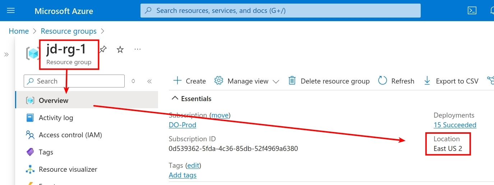
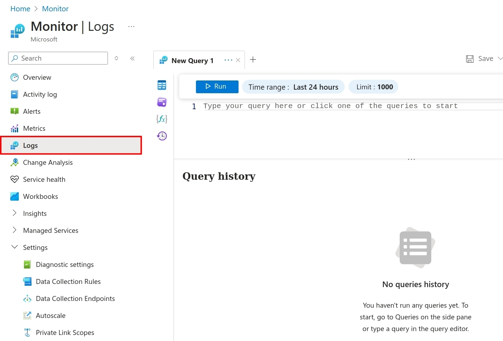

<!-- DO-MD-DEVNOTES-START -->
<!-- DO-MD-DEVNOTES-END -->
<!-- DO-MD-LABHEADER-START -->
<!-- DO-NAVTREE-TABLE-START -->
| ![][addlogosm] <br>[&#x1f3e0; Home][HOME] | Prerequisites: [[L0000]] - [[L0101]] -[[L0102]] <br> Labs: [[L0103]] - [[L0104]] - [YOU ARE HERE] - [[L2001]] - [[L2002]] - [[L2003]] - [[L2004]] - [[L2005]] - [[L2006a]] - [[L2006b]] -  [[L2007]] - [[L2008]] - [[L2009]] - [[L2010]] - [[L2011]] - [[L2012]] - [[L2013]] - [[L2014]] - <br>[[&#128210; EvID Ref][evidref]]| 
|--------|:--------|
<!-- DO-NAVTREE-TABLE-END -->

<!-- DO-LAB-TITLE START -->
# L0105 - Azure Sentinel, Data Collection Rules
Defensive Origins - Assumed Compromise Course Lab
<!-- DO-LAB-TITLE END-->

<table><tr><td width=50% valign=top>

## &#128210; Lab Overview

</td><td width=50% valign=top>

## &#x1f4cb; Lab Objectives

</td></tr><tr><td width=50% valign=top>

<!-- DO-LAB-OVERVIEW START -->
This lab is designed to provide participants with hands-on experience in using Azure Sentinel for security information and event management (SIEM) and understanding how to configure and manage data collection rules (DCRs) within Azure Sentinel.

_Conduct Lab Operations from Azure Portal_

<!-- DO-LAB-OVERVIEW END -->

</td><td width=50% valign=top>

<!-- DO-LAB-OBJECTIVES START -->
&#x1F4AC; Azure Portal  
&#x1F4AC; UI Nuances  
&#x1F4AC; Data Collection Rules  
&#x2611; Introduction to Azure Sentinel  
&#x2611; Installing and Configuring Azure Monitor Agents  
&#x2611; Creation and assignment of Data Collection Rules  
<!-- DO-LAB-OBJECTIVES END -->

</td></tr></table>


<!-- DO-MD-LABHEADER-END -->
<!-- DO-MD-LAB-START -->


<!-- DO-CREDENTIAL-REMINDER-START -->
<Details><summary>

## &#x1F512; Lab Credentials

</summary><blockquote>

### &#x1FA9F; Windows credentials

When logging into the Windows system, use the following credentials.

```Win-creds
doazlab\doadmin
DOLabAdmin1!
```

### &#x1F427; Linux credentials

When logging into the Linux system, use the following credentials.

```Linux-creds
doadmin
DOLabAdmin1!
```

</blockquote></details>

<!-- DO-CREDENTIAL-REMINDER-END -->

<Details><summary>

## &#x26a0; Region Identification (Important)

</summary><blockquote>


During the build process, you chose a region that your Azure Resource Manager deployed resources into. The builder defaults to `East US 2` like the image shown next. However, you may have changed this value, the default may be location dependent, and/or your default may not match ours! 

Also!! **DCR region configurations must match the virtual machine region from which logs are to be collected.** You will need this information in this lab. 

Be sure to note what region your resources are operating in. Selecting the incorrect region during this lab will cause errors and prevent later labs from working properly.

|  | 
|------------------------------------------------|

Or, another way to find your region would be to open another tab to https://portal.azure.com and navigate to `Resource Groups` and `Overview`.

|  | 
|------------------------------------------------|

&#x21E8; * Go to the next step!*


</blockquote></details>


<Details><summary>

## &#x2460; Access the Azure Portal

</summary><blockquote>

_Conduct Lab Operations from Azure Portal_

Access your Azure Portal

| &#x1f30e; URL | Browser on Students Local System |
|---------------|----------------------------------|
```url
https://portal.azure.com
```

The landing site should look similar to the following screenshot. Your subscription names will not match. Your recently visited resources and services are unlikely to match. 


|  |
|---------------------------|


The search bar in Azure is a crucial part of navigation.

|  | 
|------------------------------------------------|

Search for **resource** and access the **Resource Groups** under your subscription.

|  | 
|------------------------------------------------|

The resource group deployed for this class should be apparent. 

|  | 
|------------------------------------------------|

If you do not see anything, check to make sure there are no "View Filters"(tm) in the way of you seeing your resources.

|  | 
|------------------------------------------------|

There are some quirks in the UI. As shown next, clicking on the resource group opens a new sectional navigation element. The double `<<` allow you to shrink the navigation blades to the left...and back to the `>>` when appropriate.

|  | 
|------------------------------------------------|

&#x21E8; *Step Complete, Go to the next step!*


</blockquote></details>


<Details><summary>

## &#x2461; Log Analytics and Azure Monitor Agents

</summary><blockquote>

_Conduct Lab Operations from Azure Portal_

The log analytics agent is referred to as "legacy" in the Azure portal. The Azure Monitor Agent is the go-forward remote management and monitoring (RMM) tool for Azure VMs and ARC managed devices. You can see the installed agents under your Log Analytics workspace's Settings. 

To get to your Log Analytics workspace, navigate to your Resource Group for the lab environment and find the resource with type "Log Analytics Workspace".  Click on the name of the Workspace.

|  |
|------------------------------------------------|

Next, access the Agents section of the workspace. As shown in the next screenshot, the builder should have connected two Windows agents.

|  | 
|------------------------------------------------|

The builder should have also connected a Linux agent to your workspace.

|  | 
|------------------------------------------------|

Installing agents is done a couple of different ways, one of them happens when we create data collection rules (DCRs). You can also install a pre-keyed version via download and install it manually. You can also use an Azure Resource Manager (ARM) template to perform these actions...

&#x21E8; *Step Complete, Go to the next step!*


</blockquote></details>


<Details><summary>

## &#x2462; Azure Monitor

</summary><blockquote>

_Conduct Lab Operations from Azure Protal_

Use the search bar to navigate to **Azure Monitor**.

|  | 
|------------------------------------------------|

From Azure Monitor > Overview, navigate to and click on **View** under **Logs**.

|  | 
|------------------------------------------------|

You might see the following pop-up window if you are visiting here for the first time. If you have interest in going the Log Analytics introduction, take the time to do so. Close the overlay window when complete. 

|  | 
|------------------------------------------------|

The **Logs** blade provides front-end access to the data you are collecting. 

|  | 
|------------------------------------------------|

Feel free to wander around the **Monitor** window's various configuration options, services, et cetera. 

&#x21E8; *Step Complete, Go to the next step!*


</blockquote></details>


<Details><summary>

## &#x2463; Data Collection Rules

</summary><blockquote>

_Conduct Lab Operations from Azure Portal_

Data collection rules (DCRs) are the engines that power log ingestion with the Azure Monitor Agent. A quick summary of what DCRs provide:
- Automatic installation of the AMA on associated resources. 
- Granular options for defining log ingestion rules.
- OS agnostic; Linux options, Windows options, metrics options.

How do we get there? Search for dcr and click on **Data collection rules** in the results.

|  | 
|------------------------------------------------|

Click to create a new DCR. This acronym will be used frequently.

|  | 
|------------------------------------------------|

In the next steps, you will create a new DCR

&#x21E8; *Step Complete, Go to the next step!*


</blockquote></details>


<Details><summary>

## &#x2464; Create a Windows Data Collection Rule

</summary><blockquote>

_Conduct Lab Operations from Azure Portal_

We are going to go through this process to create a single DCR, so you can rinse and repeat this process anytime in the future, anywhere your career path may take you. The process would normally trigger the install of the Azure Monitor Agent on our endpoints as we define collection rules. But, we already did this when you deployed your lab environment. **Look carefully through the screenshots as they help guide instructions**.

The rule we are going to create is for SMBServer. Your subscription names and regions may differ from the example below. The region must match the region of your deployed lab environment.
- Rule Name: `SMBServer`
- Subscription: `Student Subscription Name`
- Resource Group: `Student Resource Group Name`
- Region: `Student Region`

|  | 
|------------------------------------------------|

Next, click the button for `Next : Resources >`, then on the next screen click the button to `Add resources`.

|  | 
|------------------------------------------------|

From the `+ Add Resources` window slider, expand your resource group and check the boxes for the resoure group, WS05, and DC01 systems.

|  | 
|------------------------------------------------|

Once applied, click on the button **Next : Collect and deliver >**.
<br />

The configuration for Collect and deliver is listed below and was captured for the course material in the following screenshot.
- Click to `Add data source`
- From the **Data source type** dropdown menu select `Windows Event Logs`
- Click on **Custom** to define which logs to collect
- For the XPath Query enter `Microsoft-Windows-SMBServer/Operational` and click **Add**
- Once complete, click on the button **Next : Destination >**.

|  | 
|------------------------------------------------|

The configuration for the logs destination is listed below and was captured in the subsequent screenshot.
- Click **Add destination**
- Choose `Azure Monitor Logs` in the Destination type dropdown menu
- Select your subscription from the *Subscription* dropdown menu
- Select your Log Analytics workspace from the *Account or namespace* dropdown menu
- Click the button **Add data source**

|  | 
|------------------------------------------------|

Click the **Review and create** button.

|  | 
|------------------------------------------------|

Finally, click the **Create** button.

|  | 
|------------------------------------------------|

Various pop-ups, warnings, and notifications may fly by through the console view. These are related to the initial deployment of a rules configuration, pushing an agent down to the resources, and the possibility of a "multi-extension" warning message. This warning may indicate the presence of a prior agent, in the authors' experience, the VMs had an instance of the Log Analytics agent installed and may appear similar to the messages shown next. These messages can be safely ignored. 

|  | 
|------------------------------------------------|

After just a moment, the DCR creation should indicate success. 

|  | 
|------------------------------------------------|

After 15 minutes or so, log ingestion should be caught up and available in Sentinel.

&#x21E8; *Lab Complete!*

</blockquote></details>


Copyright - All Rights Reserved, Defensive Origins LLC
<!-- DO-MD-FOOTER-END -->


<!-- DO-MD-SHORTCUTS-START -->
[1]: https://defensiveorigins.com/
[2]: https://wildwesthackinfest.com/training/
[APT]:https://github.com/DefensiveOrigins/AtomicPurpleTeam
[Cheat-Sheets]:9-Others/Cheatsheets/
[DefOrg]: https://defensiveorigins.com/
[Div1]: ../../Z-images/div/div1.png
[Div2]: ../../Z-images/div/div2.png
[DO]: https://www.defensiveorigins.com
[DO1]: ../../Z-images/logo/DO1.png
[DO1sm]: ../../Z-images/logo/DO1sm.png
[DOAboutUs]: https://defensiveorigins.com/about-us
[DOAZLab]: https://www.doazlab.com
[DOAZLab-Github]: https://github.com/DefensiveOrigins/DO-LAB
[DOImage]: ../../Z-images/do_darkbackground.jpg
[DOImage]:Z-images/do_darkbackground.jpg
[DORegister]: https://defensiveorigins.com/first-to-know/
[DOTraining]: https://training.defensiveorigins.com
[evid1]: https://github.com/DefensiveOrigins/SysmonCommunityGuide/blob/master/chapters/process-creation.md
[evid10]: https://github.com/DefensiveOrigins/SysmonCommunityGuide/blob/master/chapters/process-access.md
[evid11]: https://github.com/DefensiveOrigins/SysmonCommunityGuide/blob/master/chapters/file-create.md
[evid1100]: https://docs.microsoft.com/en-us/windows/security/threat-protection/auditing/event-1100
[evid1102]: https://docs.microsoft.com/en-us/windows/security/threat-protection/auditing/event-1102
[evid12]: https://github.com/DefensiveOrigins/SysmonCommunityGuide/blob/master/chapters/registry-actions.md
[evid13]: https://github.com/DefensiveOrigins/SysmonCommunityGuide/blob/master/chapters/registry-actions.md
[evid14]: https://github.com/DefensiveOrigins/SysmonCommunityGuide/blob/master/chapters/registry-actions.md
[evid15]: https://github.com/DefensiveOrigins/SysmonCommunityGuide/blob/master/chapters/file-stream-creation-hash.md
[evid16]: https://www.ultimatewindowssecurity.com/securitylog/encyclopedia/event.aspx?eventid=90016
[evid17]: https://github.com/DefensiveOrigins/SysmonCommunityGuide/blob/master/chapters/named-pipes.md
[evid18]: https://github.com/DefensiveOrigins/SysmonCommunityGuide/blob/master/chapters/named-pipes.md
[evid19]: https://www.ultimatewindowssecurity.com/securitylog/encyclopedia/event.aspx?eventid=90019
[evid2]: https://github.com/DefensiveOrigins/SysmonCommunityGuide/blob/master/chapters/file-create-time-change.md
[evid20]: https://www.ultimatewindowssecurity.com/securitylog/encyclopedia/event.aspx?eventid=90020
[evid21]: https://www.ultimatewindowssecurity.com/securitylog/encyclopedia/event.aspx?eventid=90021
[evid22]: https://github.com/DefensiveOrigins/SysmonCommunityGuide/blob/master/chapters/dns-query.md
[evid23]: https://github.com/DefensiveOrigins/SysmonCommunityGuide/blob/master/chapters/file_delete_detected.md
[evid24]: https://github.com/DefensiveOrigins/SysmonCommunityGuide/blob/master/chapters/clipboard-capture.md
[evid25]: https://github.com/DefensiveOrigins/SysmonCommunityGuide/blob/master/chapters/process-tampering.md
[evid255]: https://docs.microsoft.com/en-us/sysinternals/downloads/sysmon
[evid26]: https://github.com/DefensiveOrigins/SysmonCommunityGuide/blob/master/chapters/file_delete_detected.md
[evid28]: https://github.com/DefensiveOrigins/SysmonCommunityGuide/blob/master/chapters/file-delete.md
[evid3]: https://github.com/DefensiveOrigins/SysmonCommunityGuide/blob/master/chapters/network-connections.md
[evid4]: https://www.ultimatewindowssecurity.com/securitylog/encyclopedia/event.aspx?eventid=90004
[evid4610]: https://docs.microsoft.com/en-us/windows/security/threat-protection/auditing/event-4610
[evid4624]: https://docs.microsoft.com/en-us/windows/security/threat-protection/auditing/event-4624
[evid4625]: https://docs.microsoft.com/en-us/windows/security/threat-protection/auditing/event-4625
[evid4627]: https://docs.microsoft.com/en-us/windows/security/threat-protection/auditing/event-4627
[evid4634]: https://docs.microsoft.com/en-us/windows/security/threat-protection/auditing/event-4634
[evid4647]: https://docs.microsoft.com/en-us/windows/security/threat-protection/auditing/event-4647
[evid4648]: https://docs.microsoft.com/en-us/windows/security/threat-protection/auditing/event-4648
[evid4656]: https://docs.microsoft.com/en-us/windows/security/threat-protection/auditing/event-4656
[evid4657]: https://docs.microsoft.com/en-us/windows/security/threat-protection/auditing/event-4657
[evid4660]: https://docs.microsoft.com/en-us/windows/security/threat-protection/auditing/event-4660
[evid4661]: https://docs.microsoft.com/en-us/windows/security/threat-protection/auditing/event-4661
[evid4662]: https://docs.microsoft.com/en-us/windows/security/threat-protection/auditing/event-4662
[evid4663]: https://docs.microsoft.com/en-us/windows/security/threat-protection/auditing/event-4663
[evid4670]: https://docs.microsoft.com/en-us/windows/security/threat-protection/auditing/event-4670
[evid4672]: https://docs.microsoft.com/en-us/windows/security/threat-protection/auditing/event-4672
[evid4673]: https://docs.microsoft.com/en-us/windows/security/threat-protection/auditing/event-4673
[evid4688]: https://docs.microsoft.com/en-us/windows/security/threat-protection/auditing/event-4688
[evid4689]: https://docs.microsoft.com/en-us/windows/security/threat-protection/auditing/event-4689
[evid4690]: https://docs.microsoft.com/en-us/windows/security/threat-protection/auditing/event-4690
[evid4696]: https://docs.microsoft.com/en-us/windows/security/threat-protection/auditing/event-4696
[evid4697]: https://docs.microsoft.com/en-us/windows/security/threat-protection/auditing/event-4697
[evid4698]: https://docs.microsoft.com/en-us/windows/security/threat-protection/auditing/event-4698
[evid4699]: https://docs.microsoft.com/en-us/windows/security/threat-protection/auditing/event-4699
[evid4700]: https://docs.microsoft.com/en-us/windows/security/threat-protection/auditing/event-4700
[evid4701]: https://docs.microsoft.com/en-us/windows/security/threat-protection/auditing/event-4701
[evid4702]: https://docs.microsoft.com/en-us/windows/security/threat-protection/auditing/event-4702
[evid4703]: https://docs.microsoft.com/en-us/windows/security/threat-protection/auditing/event-4703
[evid4704]: https://docs.microsoft.com/en-us/windows/security/threat-protection/auditing/event-4704
[evid4705]: https://docs.microsoft.com/en-us/windows/security/threat-protection/auditing/event-4705
[evid4706]: https://docs.microsoft.com/en-us/windows/security/threat-protection/auditing/event-4706
[evid4707]: https://docs.microsoft.com/en-us/windows/security/threat-protection/auditing/event-4707
[evid4715]: https://docs.microsoft.com/en-us/windows/security/threat-protection/auditing/event-4715
[evid4716]: https://docs.microsoft.com/en-us/windows/security/threat-protection/auditing/event-4716
[evid4717]: https://docs.microsoft.com/en-us/windows/security/threat-protection/auditing/event-4717
[evid4719]: https://docs.microsoft.com/en-us/windows/security/threat-protection/auditing/event-4719
[evid4720]: https://docs.microsoft.com/en-us/windows/security/threat-protection/auditing/event-4720
[evid4722]: https://docs.microsoft.com/en-us/windows/security/threat-protection/auditing/event-4722
[evid4723]: https://docs.microsoft.com/en-us/windows/security/threat-protection/auditing/event-4723
[evid4724]: https://docs.microsoft.com/en-us/windows/security/threat-protection/auditing/event-4724
[evid4725]: https://docs.microsoft.com/en-us/windows/security/threat-protection/auditing/event-4725
[evid4726]: https://docs.microsoft.com/en-us/windows/security/threat-protection/auditing/event-4726
[evid4731]: https://docs.microsoft.com/en-us/windows/security/threat-protection/auditing/event-4731
[evid4732]: https://docs.microsoft.com/en-us/windows/security/threat-protection/auditing/event-4732
[evid4733]: https://docs.microsoft.com/en-us/windows/security/threat-protection/auditing/event-4733
[evid4735]: https://docs.microsoft.com/en-us/windows/security/threat-protection/auditing/event-4735
[evid4736]: https://docs.microsoft.com/en-us/windows/security/threat-protection/auditing/event-4736
[evid4738]: https://docs.microsoft.com/en-us/windows/security/threat-protection/auditing/event-4738
[evid4739]: https://docs.microsoft.com/en-us/windows/security/threat-protection/auditing/event-4739
[evid4740]: https://docs.microsoft.com/en-us/windows/security/threat-protection/auditing/event-4740
[evid4741]: https://docs.microsoft.com/en-us/windows/security/threat-protection/auditing/event-4741
[evid4742]: https://docs.microsoft.com/en-us/windows/security/threat-protection/auditing/event-4742
[evid4743]: https://docs.microsoft.com/en-us/windows/security/threat-protection/auditing/event-4743
[evid4764]: https://docs.microsoft.com/en-us/windows/security/threat-protection/auditing/event-4764
[evid4765]: https://docs.microsoft.com/en-us/windows/security/threat-protection/auditing/event-4765
[evid4767]: https://docs.microsoft.com/en-us/windows/security/threat-protection/auditing/event-4767
[evid4768]: https://docs.microsoft.com/en-us/windows/security/threat-protection/auditing/event-4768
[evid4769]: https://docs.microsoft.com/en-us/windows/security/threat-protection/auditing/event-4769
[evid4770]: https://docs.microsoft.com/en-us/windows/security/threat-protection/auditing/event-4770
[evid4773]: https://docs.microsoft.com/en-us/windows/security/threat-protection/auditing/event-4773
[evid4776]: https://docs.microsoft.com/en-us/windows/security/threat-protection/auditing/event-4776
[evid4780]: https://docs.microsoft.com/en-us/windows/security/threat-protection/auditing/event-4780
[evid4781]: https://docs.microsoft.com/en-us/windows/security/threat-protection/auditing/event-4781
[evid4782]: https://docs.microsoft.com/en-us/windows/security/threat-protection/auditing/event-4782
[evid4798]: https://docs.microsoft.com/en-us/windows/security/threat-protection/auditing/event-4798
[evid4799]: https://docs.microsoft.com/en-us/windows/security/threat-protection/auditing/event-4799
[evid4817]: https://docs.microsoft.com/en-us/windows/security/threat-protection/auditing/event-4817
[evid4907]: https://docs.microsoft.com/en-us/windows/security/threat-protection/auditing/event-4907
[evid4908]: https://docs.microsoft.com/en-us/windows/security/threat-protection/auditing/event-4908
[evid4964]: https://docs.microsoft.com/en-us/windows/security/threat-protection/auditing/event-4964
[evid5]: https://github.com/DefensiveOrigins/SysmonCommunityGuide/blob/master/chapters/process-termination.md
[evid5025]: https://docs.microsoft.com/en-us/windows/security/threat-protection/auditing/event-5025
[evid5136]: https://docs.microsoft.com/en-us/windows/security/threat-protection/auditing/event-5136
[evid5137]: https://docs.microsoft.com/en-us/windows/security/threat-protection/auditing/event-5137
[evid5138]: https://docs.microsoft.com/en-us/windows/security/threat-protection/auditing/event-5138
[evid5139]: https://docs.microsoft.com/en-us/windows/security/threat-protection/auditing/event-5139
[evid5140]: https://docs.microsoft.com/en-us/windows/security/threat-protection/auditing/event-5140
[evid5141]: https://docs.microsoft.com/en-us/windows/security/threat-protection/auditing/event-5141
[evid5142]: https://docs.microsoft.com/en-us/windows/security/threat-protection/auditing/event-5142
[evid5143]: https://docs.microsoft.com/en-us/windows/security/threat-protection/auditing/event-5143
[evid5144]: https://docs.microsoft.com/en-us/windows/security/threat-protection/auditing/event-5144
[evid5145]: https://docs.microsoft.com/en-us/windows/security/threat-protection/auditing/event-5145
[evid5152]: https://docs.microsoft.com/en-us/windows/security/threat-protection/auditing/event-5152
[evid5157]: https://docs.microsoft.com/en-us/windows/security/threat-protection/auditing/event-5157
[evid5158]: https://docs.microsoft.com/en-us/windows/security/threat-protection/auditing/event-5158
[evid5159]: https://docs.microsoft.com/en-us/windows/security/threat-protection/auditing/event-5159
[evid5168]: https://docs.microsoft.com/en-us/windows/security/threat-protection/auditing/event-5168
[evid5447]: https://docs.microsoft.com/en-us/windows/security/threat-protection/auditing/event-5447
[evid6]: https://github.com/DefensiveOrigins/SysmonCommunityGuide/blob/master/chapters/driver-loading.md
[evid6145]: https://docs.microsoft.com/en-us/windows/security/threat-protection/auditing/event-6145
[evid7]: https://github.com/DefensiveOrigins/SysmonCommunityGuide/blob/master/chapters/image-loading.md
[evid8]: https://github.com/DefensiveOrigins/SysmonCommunityGuide/blob/master/chapters/create-remote-thread.md
[evid9]: https://github.com/DefensiveOrigins/SysmonCommunityGuide/blob/master/chapters/raw-access-read.md
[evidsysmon]: https://docs.microsoft.com/en-us/sysinternals/downloads/sysmon
[H0004]: ../../../APT/9-Others/H0040-Instructors/README.md
[H0010]: ../../../APT/9-Others/H0010-PreReq/README.md
[ph_jd]: ../../Z-images/photo/jd1.png
[ph_ki]: ../../Z-images/photo/ki1.png
[refmstp-pdf]: https://docs.microsoft.com/en-us/windows/security/opbuildpdf/threat-protection/auditing/toc.pdf?branch=live
[refmstp-web]: https://docs.microsoft.com/en-us/windows/security/threat-protection/
[Survey]:https://forms.office.com/Pages/ResponsePage.aspx?id=ezi0P6h7Wky98F15YOOzAxFXFOo3MeNFpviudN0SuLhUMDNCT1NYWk5QWjlHUkMyMVhJVjFJTjhQMy4u
[WWHF]: https://wildwesthackinfest.com/
[addlogo]:../../Z-images/logo/add.png
[addlogosm]:../../Z-images/logo/addsm.png
<!-- DO-MD-SHORTCUTS-END -->
<!-- DO-MD-NAVTREE-SHORTCUTS-START -->
[Home]: ../../README.md
[evidref]: ../../9-Others/Cheatsheets/EventIDs.md
[L0000]: /1-Labs/0000-Course-Architecture/README.md
[L0101]: /1-Labs/0101-Azure-Components/README.md
[L0102]: /1-Labs/0102-Lab-Deploy/README.md
[L0103]: /1-Labs/0103-Initial-Access/README.md
[L0104]: /1-Labs/0104-Terminals/README.md
[L0105]: /1-Labs/0105-Azure-DCRs-Sentinel/README.md
[L0106]: /1-Labs/0101-Azure-Components/README.md
[L2001]: /1-Labs/2001-BadBlood/README.md
[L2002]: /1-Labs/2002-Deception/README.md
[L2003]: /1-Labs/2003-Initial-Checks/README.md
[L2004]: /1-Labs/2004-PowerShell-CMD/README.md
[L2006]: /1-Labs/2006-ADCS/README.md
[L2005]: /1-Labs/2005-Tooling/README.md
[L2006a]: /1-Labs/2006a-BloodHound/README.md
[L2006b]: /1-Labs/2006b-PlumHound/README.md
[L2007]: /1-Labs/2007-ADCS/README.md
[L2008]: /1-Labs/2008-Impacket/README.md
[L2009]: /1-Labs/2009-Password-Spray/README.md
[L2010]: /1-Labs/2010-C2-SSH/README.md
[L2011]: /1-Labs/2011-Coercion-Relay/README.md
[L2012]: /1-Labs/2012-LNK-Droppers/README.md
[L2013]: /1-Labs/2013-Attacker-Attribution/README.md
[L2014]: /1-Labs/2014-Atomic-Red-Team/README.md
<!-- DO-MD-NAVTREE-SHORTCUTS-END -->
