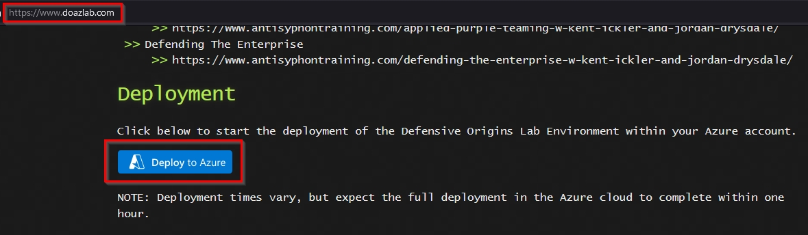
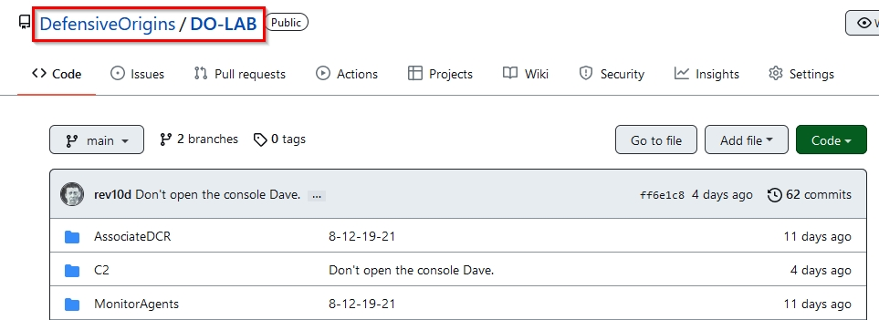
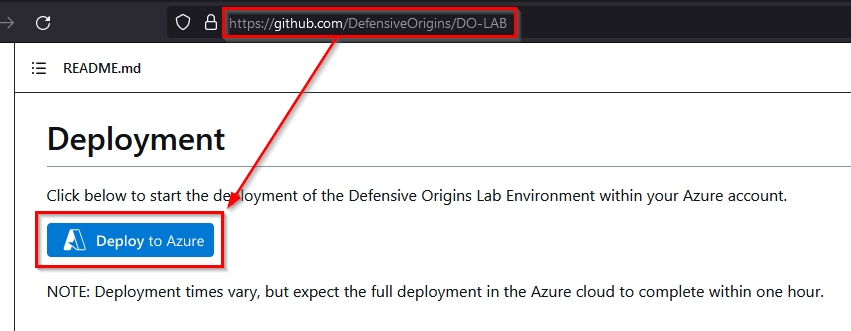
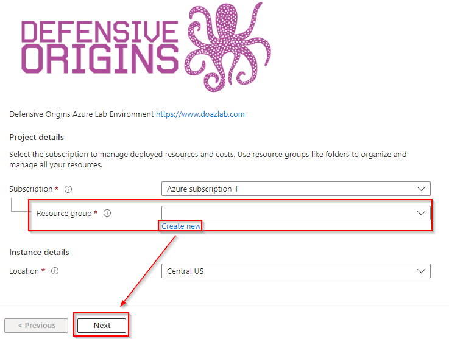
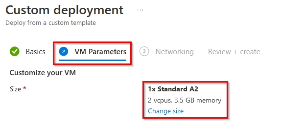
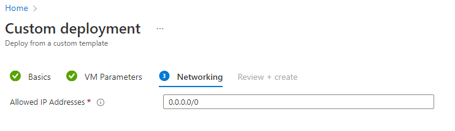
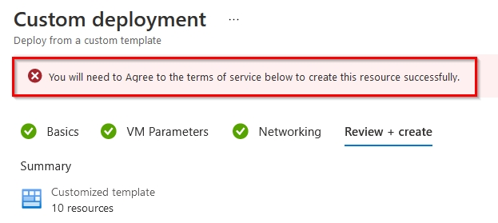
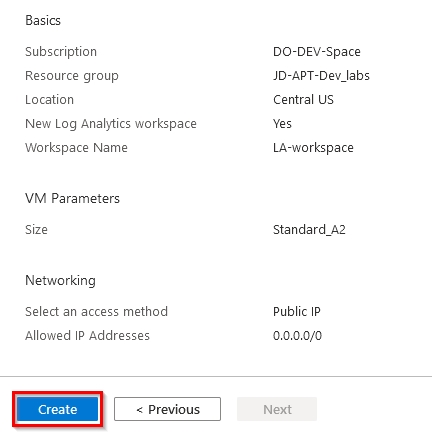
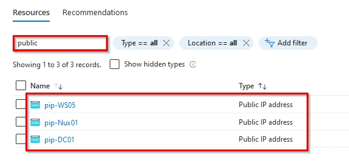
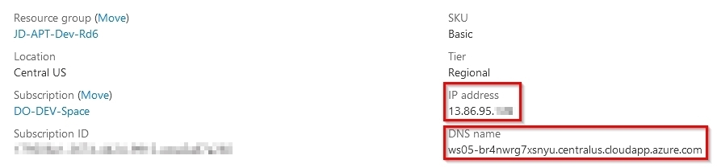

# Pre-Requisite : Deploy course Lab Environment (DOAZLab.com)

![][Div2]

Students are required to deploy the DOAZLab in their azure subscription.

## Important Information
* An "upgraded" or "Pay-as-you-go" Azure account is required to deploy the lab environment.  See other pre-requisite instruction if you do not yet have an Azure account.
* The cost of the lab environment is approximately $10/day.
* Remember after the end of class delete your lab environment to ensure you have no unexpected fees from Azure.
* The VM size selection will default to B2s, A2,or A2_V2 depending on region selection and availability.  Generally B2s is least expensive if available. Any of these options are acceptable for the lab environment.

## Deploy Defensive Origins Azure Lab (DOAZLab)

 <b> Step 1: Kickoff Deployment</b>

<blockquote>

Deploy the Defensive Origins AZLab from doazlab.com:
* https://www.doazlab.com

[DOAZLab][DOAZLab]

|  |
|----------------------------|

Or, you can view the operations in more detail on GitHub:
[DOAZLab-Github][DOAZLab-Github]

|  |
|----------------------------|

And, deploy via the README with one click!! 

**Be sure you are in a browser session you are either comfortable authenticating to Azure or you already have an authenticated session.**

|  |
|----------------------------|

Next up you will choose your subscription, resource group, and log analytics workspace. For easy deployments and cleanup, a general recommendation is to create a new resource group and log analytics workspace. 

|  |
|----------------------------|

The VM size selection will default to B2s, A2,or A2_V2 depending on region selection and availability. 
**Generally B2s is least expensive** if available. Any of these options are acceptable for the lab environment.

Feel free to modify the size of your VMs should you so choose. The default selections made for this course have been tested thoroughly and represent a balance of performance and cost.

|  |
|----------------------------|

The next step in your custom deployment is to confirm the public IP space. Feel free to limit this range more specifically to your known and trusted addresses. 

**Please be aware that a demonstration will be provided and a discussion around this exposure and that leaving this address wide open (0.0.0.0/0) presents an interesting perspective of the Internet and the risks of exposing services there.**

|  |
|----------------------------|

That is pretty much it for the configuration of your ARM template based deployment of the DO AZ lab environment. The next screenshot includes a warning about agreeing to the terms on Microsoft.

|  |
|----------------------------|

Whether you agree or not, should you choose to click Create, you implicitly do.

|  |
|----------------------------|

The full deployment will take approximately 45 minutes.  You do not need to keep the window open, the process will continue even if you close it.  In the following section, you will configure the new lab environment to report logs to Azure Sentinel.  You must wait for deployment to complete before continuing.
</blockquote>

 <b>Step 2: Gather Public IP Addresses for Access</b>

<blockquote>

Gather your public IP addresses. 

**https://portal.azure.com/#home --> Resource groups --> <DO_Lab_Resource_Group> --> Resources --> Filter --> "public"**

|  |
|----------------------------|

Click through each resource to gather the assigned public IP addresses.

|  |
|----------------------------|

As you gather them up, document them! The addresses in the list below do not represent your IP addresses.

* DC Public IP: 13.67.200.257
* Nux Public IP: 40.86.95.257
* WS Public IP: 13.86.95.257

</blockquote>

![div2]

Copyright - All Rights Reserved, Defensive Origins LLC

  [Div1]: ../images/div1.png
  [Div2]: ../images/div2.png
  [DO]: https://www.defensiveorigins.com
  [DOAZLab]: https://www.doazlab.com
  [DOAZLab-Github]: https://github.com/DefensiveOrigins/DO-LAB
  [DOTraining]: https://training.defensiveorigins.com
  [DORegister]: https://defensiveorigins.com/first-to-know/
  [DOAboutUs]: https://defensiveorigins.com/about-us
  [WWHF]: https://wildwesthackinfest.com/
  [1]: https://defensiveorigins.com/
  [2]: https://wildwesthackinfest.com/training/
  [DOImage]:Z-images/do_darkbackground.jpg